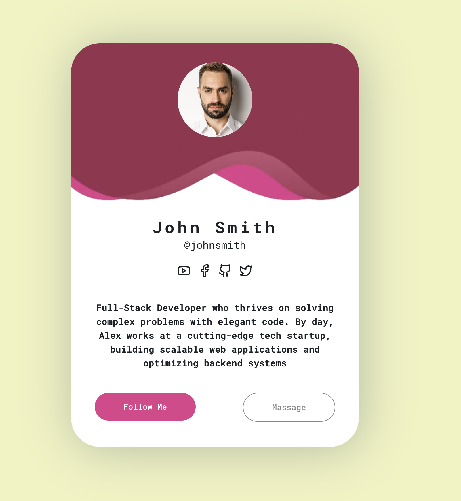

```
# Programmer Profile Card 🚀
```

# Welcome to the **Programmer Profile Card** project! This is a simple yet elegant digital business card built using **Reflex** (formerly Nextpy). It’s designed to showcase the skills, personality, and contact information of a programmer in a clean and modern way.


```
## 🧑‍💻 About the Project
```

### This project is a **digital business card** created with **Reflex**, a Python framework for building web applications. It’s a perfect example of how you can use Reflex to create sleek, responsive, and interactive UI components with minimal code.
The card includes:

- A profile picture
- A short bio
- Key skills
- Social media links
- A clean and modern design

## **Install** 

```
git clone https://github.com/AnonimPython/Reflex-Card.git
cd Reflex-Card
reflex run

```
